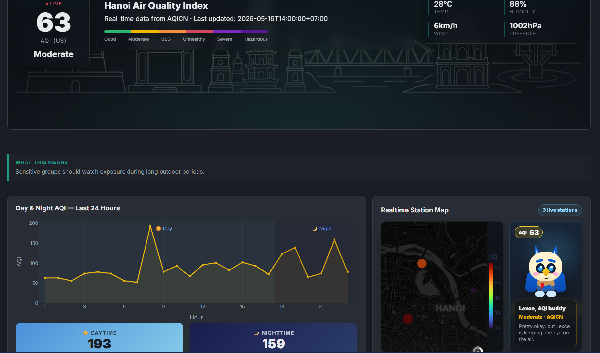
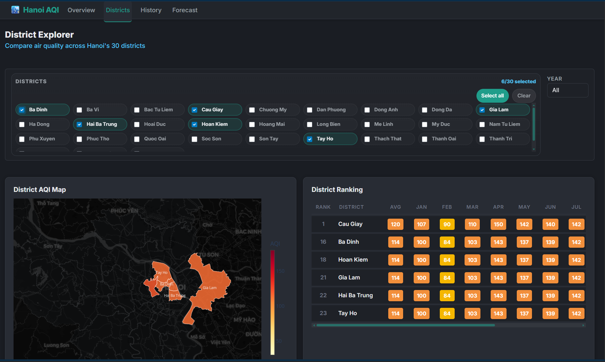
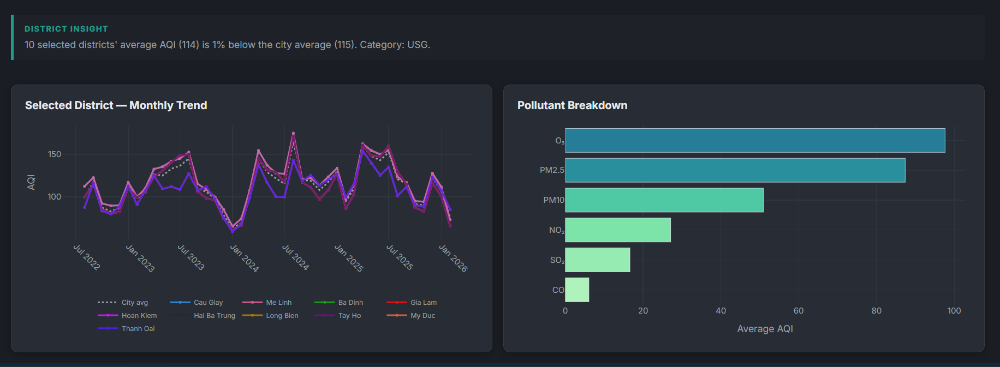
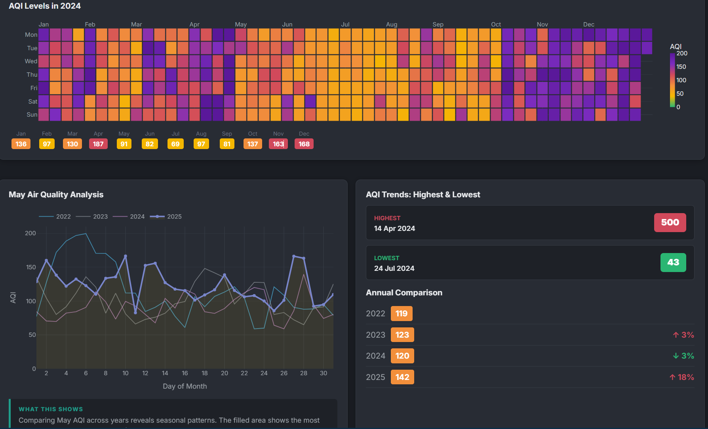
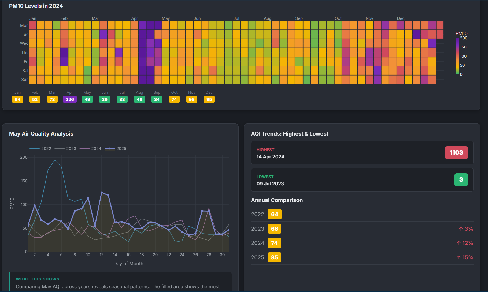
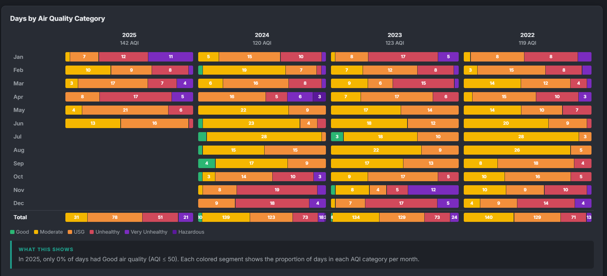
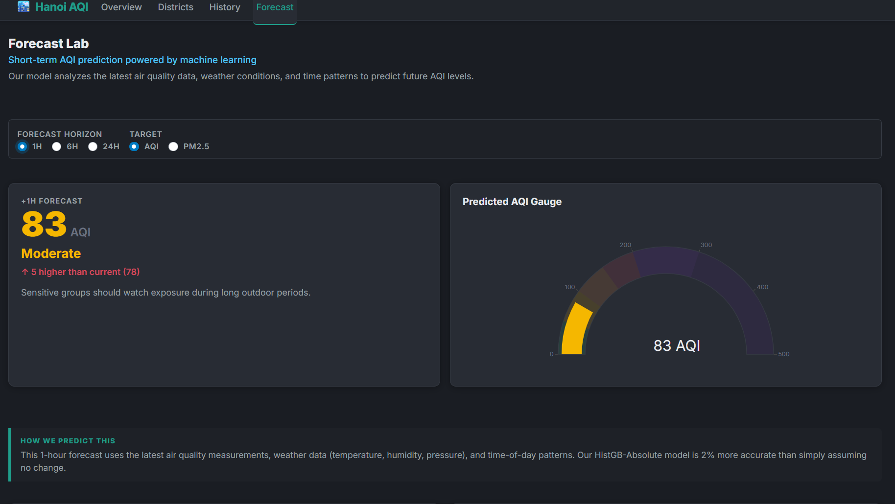
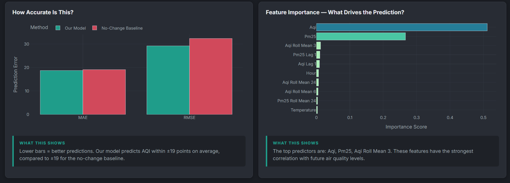
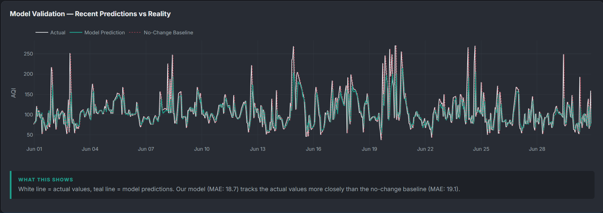

# Proposal Slide Structure

Purpose: this file is for the teammate who will design and present the 5-minute proposal slides. The slides should describe the **actual current dashboard**, not only a future idea.

Replace `[GitHub link]` with the final repository link before submitting.

## Slide 1 - Title and Hook

**Title:** Hanoi Air Quality Pulse

**Subtitle:** Interactive spatial, temporal, realtime, and predictive visualization of Hanoi air pollution.

**Visual:** Screenshot of the Overview page hero.



**Speaker notes:**
- We are building a Python Shiny dashboard about Hanoi AQI.
- The dashboard is already a working prototype and will be used as the proposal wireframe.
- The key idea is to move from "one AQI number for Hanoi" to an interactive story across districts, time, weather, and forecast risk.

## Slide 2 - Motivation and Main Question

**Main question:**
How does air pollution vary across Hanoi districts and time, and can recent air-quality/weather signals support short-term AQI prediction?

**Why it matters:**
- AQI is a public-health signal.
- A single citywide number hides district-level and hourly differences.
- Users need context: where, when, why, and what might happen next.

**Speaker notes:**
- Pollution exposure is not uniform.
- The dashboard lets users explore patterns interactively instead of reading static charts.

## Slide 3 - Dataset Description

**Dataset 1: District-level Hanoi air quality**
- Source: Kaggle `hau100416/vietnamese-air-quality-dataset`.
- Hanoi district coverage: 30 districts.
- Hourly Hanoi subset: 920,160 rows.
- Time range: 2022-08-04 to 2026-02-01.
- Used for: district choropleth, ranking table, monthly trends, pollutant breakdowns.

**Dataset 2: City-level AQI + weather**
- Source: Kaggle `phungdinhdat/aqi-in-hanoi-2022-2025`.
- 30,341 hourly rows.
- Time range: 2022-01-13 to 2025-06-30.
- Variables: AQI, PM2.5, PM10, CO, NO2, O3, SO2, temperature, humidity, pressure, precipitation, wind, cloud cover, UV index.
- Used for: history charts and forecast model.

**Additional data/APIs:**
- `hanoi_districts.geojson` for district boundaries.
- AQICN/WAQI for realtime stations.
- Open-Meteo for fallback weather/air context.

## Slide 4 - Visualization Challenge

**Why this is hard to visualize:**
- Spatial: 30 districts.
- Temporal: hourly, daily, monthly, seasonal patterns.
- Multivariate: several pollutants plus weather variables.
- Mixed sources: historical data, realtime APIs, spatial boundaries, model outputs.
- Reliability issue: realtime station data can be stale or missing.

**Speaker notes:**
- This is why the dashboard needs multiple coordinated views, not one chart.
- The user should be able to move from overview to detail and from history to forecast.

## Slide 5 - Working Wireframe / Dashboard Architecture

**Visual:** Use a 2x2 layout screenshot collage of the four tabs.

**Overview tab:**


**Districts tab:**





**History tab:**







**Forecast tab:**







**Four pages:**
1. Overview: current AQI, weather, day/night pattern, realtime station map, Lexce mascot.
2. Districts: choropleth map, multi-select filter, ranking table, district trend, pollutant breakdown.
3. History: calendar heatmap, multi-year comparison, category distribution.
4. Forecast: prediction card, AQI gauge, model-vs-baseline error, feature importance, validation plot.

**Speaker notes:**
- For proposal, this dashboard acts as the wireframe sketch.
- The final version will polish visuals and deployment, but the interaction structure is already implemented.

## Slide 6 - Wireframe Annotation Checklist

Use this slide or a separate PowerPoint/draw.io wireframe page. Add arrows and labels.

**Overview screenshot annotations:**


- AQI hero: shows current AQI, source, timestamp, AQI category.
- Weather card: temperature, humidity, wind, pressure.
- Day/night chart: last 24-hour AQI pattern.
- Station map: realtime AQICN station points.
- Lexce mascot: changes mood/message based on AQI category.

**District screenshot annotations:**


- District picker: Select all/Clear and checkbox selection.
- Choropleth map: selected districts colored by AQI; unselected districts muted.
- Ranking table: only selected districts appear; monthly AQI shown as colored cells.
- Monthly trend: selected districts over time; city average baseline.
- Pollutant breakdown: average pollutant AQI components for selected districts.

**History screenshot annotations:**


- Pollutant/year controls.
- Calendar heatmap for daily AQI/PM2.5/PM10.
- Multi-year comparison.
- AQI category distribution.

**Forecast screenshot annotations:**


- Horizon and target controls.
- Forecast card/gauge.
- Model vs no-change baseline error.
- Feature importance.
- Validation: predicted vs actual.

## Slide 7 - Planned Visualization and Interaction Methods

**Chart types:**
- Choropleth map.
- Line charts.
- Calendar heatmap.
- Bar charts.
- Gauge chart.
- Ranking heatmap table.
- Realtime station map.

**Interactions:**
- District multi-select filtering.
- Select all/Clear district controls.
- Muted context layer for unselected districts.
- Pollutant/year controls on History.
- Forecast horizon and target controls.
- Hover tooltips and linked narrative insight boxes.

**Speaker notes:**
- The design is not just decorative; interaction controls the analytical story.
- District selection updates multiple views together.

## Slide 8 - Analytical and ML Methods

**Forecasting target:**
- AQI and PM2.5.

**Forecast horizons:**
- 1h, 6h, 24h.

**Features:**
- Current pollutants.
- Weather variables.
- Time features: hour, day of week, month, weekend.
- Lag features: 1h, 6h, 24h.
- Rolling mean/max windows: 3h, 6h, 24h.

**Model:**
- Scikit-learn Histogram Gradient Boosting Regressor variants.
- Chronological train/test validation.
- Comparison baseline: no-change/persistence forecast.
- Metrics: MAE and RMSE.
- Model explanation: feature importance and validation chart.

**Speaker notes:**
- The forecast is framed as short-term risk prediction.
- The model is embedded into visual analytics, so users see not only the prediction but also evidence and uncertainty.

## Slide 9 - Technology Stack

**Dashboard:**
- Python Shiny.
- Plotly.
- Custom CSS dark theme.

**Data processing:**
- Pandas.
- NumPy.
- Parquet preprocessing for faster loading.

**Modeling:**
- scikit-learn.
- Joblib model cache.

**Spatial/realtime:**
- Hanoi GeoJSON district boundaries.
- AQICN/WAQI API.
- Open-Meteo fallback API.

**Current run command:**

```bash
cd /vol/biomedic3/gn425/HaNoiAQI/dashboard
.venv/bin/shiny run app.py
```

## Slide 10 - Initial Development Plan and Team Allocation

**Phase 1: Proposal, due 18/05**
- Submit under-500-word proposal write-up.
- Submit annotated wireframe using dashboard screenshots.
- Present dataset, plan, visual methods, ML/API methods, GitHub link.

**Phase 2: Final project, due 07/06**
- Polish dashboard UI/UX and background image.
- Strengthen model explanation and findings.
- Validate realtime API fallback behavior.
- Deploy Shiny app.
- Write final report.

**Suggested team roles:**
- Data/preprocessing: dataset notes, GeoJSON matching, data limitations.
- UI/wireframe: screenshots, annotation, slide visuals.
- Visualization/story: explain dashboard flow and interactions.
- Model/API: forecasting method, AQICN/Open-Meteo logic, metrics.

## Slide 11 - GitHub Repository

**Content to mention:**
- Proposal write-up: `proposal_writeup.md`.
- Project plan: `project_plan.md`.
- Slide structure: `slide_structure.md`.
- Dashboard code: `dashboard/app.py`, `dashboard/modules/`, `dashboard/src/`.
- Processed files and model cache documented in `dashboard/README.md`.

**GitHub link:**
- `[GitHub link]`

## Slide 12 - 5-Minute Presentation Script

Suggested timing:

1. **0:00-0:40 - Hook**
   - Hanoi AQI should not be reduced to one number.
   - Introduce main question.

2. **0:40-1:30 - Data**
   - Explain two datasets, district boundaries, APIs.

3. **1:30-3:10 - Dashboard wireframe**
   - Overview, Districts, History, Forecast.
   - Emphasize interaction and linked story.

4. **3:10-4:10 - Methods**
   - Shiny/Plotly/Pandas/scikit-learn.
   - Forecasting features, baseline, metrics.

5. **4:10-5:00 - Plan**
   - What is already built for proposal.
   - What will be improved for final submission.
   - GitHub link and deployment plan.
